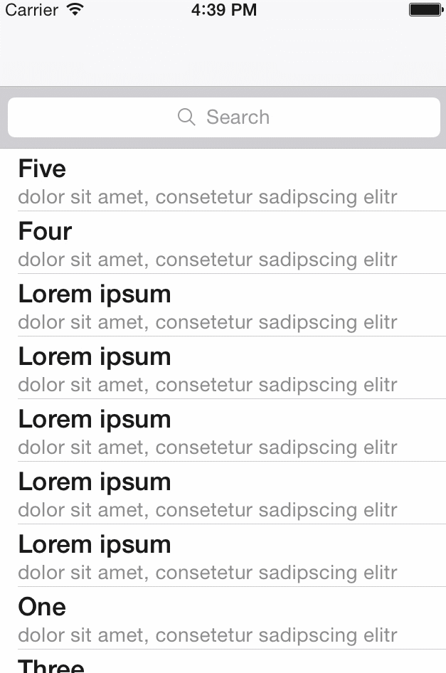

QMBFetchedResultsViewController
===============================

A simple UIViewController subclass that implements NSFetchedResultsControllerDelegate and manages a table view binded to a custom fetch request.

- Simple fetch requests
- Support of sections
- Simple customization via overriding
- Use Offset to manage custom sections or rows (at the top)
- Addional Filter Controller (inspired by: [lukagabric/LargeDatasetSample](https://github.com/lukagabric/LargeDatasetSample))

### Pod ###

Not yet contributed but you can include it via:
<pre>

pod 'QMBFetchedResultsViewController', :git => 'https://github.com/quemb/QMBFetchedResultsViewController.git'

</pre>

### Example ###

Set your managed object context via override:
<pre>

- (NSManagedObjectContext *)managedObjectContext
{
    return [((QMBAppDelegate *)[[UIApplication sharedApplication] delegate]) managedObjectContext];
}

</pre>

Set your fetch Request (section is optional):
<pre>
- (NSFetchRequest *)getFetchRequest
{
    NSFetchRequest *fetchRequest = [[NSFetchRequest alloc] init];
    
    
    NSEntityDescription *entity = [NSEntityDescription
                                   entityForName:@"Sample" inManagedObjectContext:[self managedObjectContext]];
    [fetchRequest setEntity:entity];
    
    [fetchRequest setSortDescriptors:[NSArray arrayWithObjects:
                                      [[NSSortDescriptor alloc] initWithKey:@"title" ascending:YES],
                                      nil]];
    
    return fetchRequest;
}
</pre>

Set your UITableViewCell - styles
<pre>
- (void)configureCell:(UITableViewCell *)cell atIndexPath:(NSIndexPath *)indexPath
{
    Sample *sample = (Sample *)[self.fetchedResultsController objectAtIndexPath:indexPath];
    cell.textLabel.text = sample.title;
    cell.detailTextLabel.text = sample.subtitle;
}
</pre>

### Credits ###
- [raywenderlich | Example](http://www.raywenderlich.com/999/core-data-tutorial-how-to-use-nsfetchedresultscontroller)
- [lukagabric | LargeDatasetSample](https://github.com/lukagabric/LargeDatasetSample)
